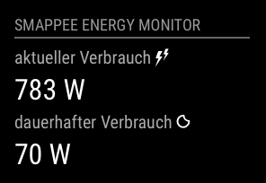

[](https://smappee.atlassian.net/wiki/spaces/DEVAPI/overview)
[](https://codeclimate.com/github/CFenner/MMM-Smappee/maintainability)
[](https://codeclimate.com/github/CFenner/MMM-Smappee/test_coverage)

# MMM-Smappee
A module for the MagicMirror, to display informations about the currently energy consumption measured by a Smappee Energy Monitor.



## Usage

_Prerequisites_

- requires MagicMirror v2.0.0
- a Smappee Energy Monitor at home
- an API key for Smappee API (request via email to support@smappee.com)

### API Access

To use this module, it is required to have access to Smappees API. 
You can request access to the API by opening a [ticket](https://support.smappee.com) or by sending an [email](mailto:support@smappee.com) with the following information:
- full name
- account name
- serial number

### Installation

To install this module, just clone this repository to the __modules__ folder of your MagicMirror: 

```
git clone https://github.com/CFenner/MMM-Smappee.git
```

### Configuration

The module needs the standard configuration block in your config.js to work.

```
{
	module: 'MMM-Smappee',
	position: 'bottom_left',
	config: {
        user: {
            id: '<smappee user id>', 
            password: '<smappee user password>'
        },
        client: {
            id: '<smappee api client id>', 
            secret: '<smappee api client secret>'
        },
	}
}
```

## Languages

The following languages are available:
- :uk:
- :de: 

Further contributions welcome!
